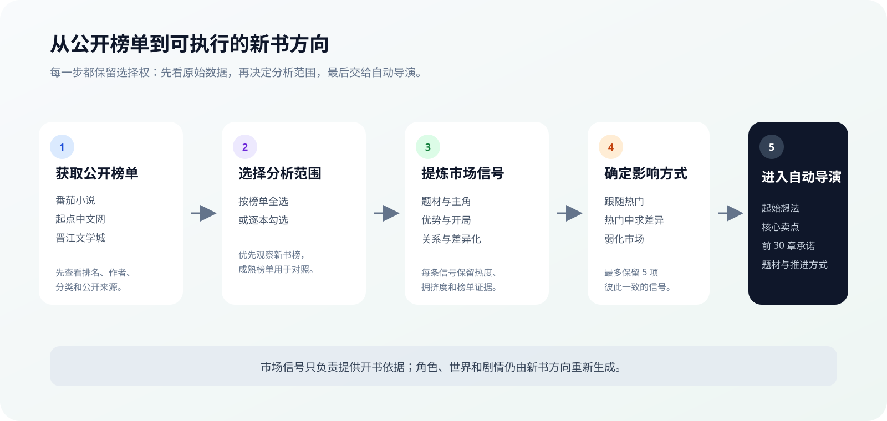

# 热门题材雷达

热门题材雷达用于把公开排行榜变成可核对、可选择的开书依据。它先展示原始榜单，再由你决定分析哪些作品；AI 只从已选范围提炼信号，最后把信号交给自动导演生成新书方向。

## 它能帮你做什么

- 查看番茄小说、起点中文网和晋江文学城的公开榜单。
- 优先观察新书榜、新晋作者榜，也可以选择成熟榜单作对照。
- 按榜单全选或逐本勾选本次要分析的作品。
- 从已选作品中提炼题材、主角、核心优势、开局、关系、标题和差异化机会。
- 把最多 5 项市场信号直接交给自动导演开书。
- 将缺少的题材基底或推进模式加入资源库。

它适合解决“想写网文，但不知道该从哪个方向起步”的问题。它提供的是开书参考，不是销量承诺，也不会替代作者对题材和受众的判断。

## 推荐使用路径

1. 从左侧“创作”分组打开“热门题材雷达”。
2. 等待公开榜单获取完成，先阅读原始排名、作者和分类。
3. 在每张榜单卡片中全选或逐本勾选作品。
4. 点击“开始 AI 分析”，只分析当前勾选范围。
5. 核对每条信号的热度、拥挤度和榜单证据。
6. 保留最适合自己的 1～5 项信号，并选择市场影响方式。
7. 点击“用这些信号创作”，进入自动导演开书设置。

:::tip 第一次使用怎么选
优先保留一条“差异化机会”，再搭配题材、主角身份、核心优势或开局爆点。不要为了信息丰富把 5 个相互冲突的方向全部带入。
:::

## 扫榜和 AI 分析为什么分开

页面把两个动作分开处理：

| 动作 | 你会得到什么 | 是否调用创作模型 |
| --- | --- | --- |
| 获取榜单 | 公开排名、书名、作者、分类和来源链接 | 否 |
| AI 分析 | 当前选择范围内的趋势、机会、拥挤套路和证据 | 是 |

这样可以先确认数据范围，再决定是否消耗模型额度。某个平台读取失败时，页面会保留其他平台已成功获取的数据；全部失败时应先重新扫榜，不要直接发起空分析。

## 如何选择榜单和作品

新书榜和新晋作者榜更接近当前开书环境，适合做默认观察范围；成熟榜单适合判断长期题材和稳定读者期待。

选择时注意：

- 每张榜单都可以全选，也可以只选其中几本。
- 页面会展示本次成功识别的数量，公开页面数据不代表平台全部作品。
- AI 报告生成后，如需更换作品范围，应重新扫榜并重新选择。
- 外部来源链接用于核对公开证据，不建议只看标题就判断题材趋势。

## 市场信号怎么看

报告会按用途整理信号：

| 信号 | 适合回答的问题 |
| --- | --- |
| 热门题材 | 哪类故事正在形成明显供给和读者兴趣 |
| 主角身份 | 当前作品常用哪些主角起点 |
| 金手指 / 核心优势 | 主角靠什么形成持续推进能力 |
| 开局爆点 | 前几章通常用什么压力或异常抓住读者 |
| 关系卖点 | 哪类人物关系容易形成长期张力 |
| 标题句式 | 标题怎样快速传达题材与核心卖点 |
| 差异化机会 | 在热门方向中可以避开的拥挤点 |
| 拥挤套路 | 哪些组合已经高度同质化 |

热度高不等于适合直接跟随。拥挤度也高时，优先查看“差异化机会”和证据，再决定是否使用。

## 三种市场影响方式

| 方式 | 适合谁 | 对自动导演的影响 |
| --- | --- | --- |
| 跟随热门 | 想快速进入明确赛道 | 更明显保留当前热门结构与卖点 |
| 热门中求差异 | 大多数新书 | 保留读者熟悉感，同时强化差异化信号 |
| 弱化市场 | 已有清晰个人方向 | 市场只作参考，不主导整书定位 |

对第一次开书的用户，推荐“热门中求差异”。

## 信号如何进入自动导演

点击“用这些信号创作”后，系统会把最终选择整理成创作简报，并在开书页带入：

- 可直接继续修改的一段起始想法。
- 金手指或核心优势。
- 核心卖点和前 30 章承诺。
- 推荐的题材基底、主要推进和辅助推进。
- 对应的市场信号摘要与证据来源。

你在开书页手动选择的题材或推进方式优先保留。雷达建议用于填充空白，不会覆盖明确选择。

## 资源库提示怎么看

报告中的题材和推进方式可能已经存在于资源库，也可能需要加入：

- “库中已有”：可以直接进入资源库定位并查看。
- “需要加入”：确认后创建对应资源，完成后再用于新书。

先复用已有资源，可以减少近义题材或重复推进方式不断累积。

## 常见问题

### 为什么只看到部分榜单

公开页面可能临时不可用或结构发生变化。先查看平台状态，使用已成功获取的数据；需要跨平台比较时再重新扫榜。

### 为什么 AI 分析按钮不可用

先等待扫榜完成，并至少勾选一本作品。生成报告期间不能重复提交同一轮分析。

### 可以直接照着榜单作品写吗

不建议。雷达用于提炼市场信号和差异化机会，不负责复制具体人物、世界或情节。需要研究一本参考作品时，使用“拆书”；需要从拆书结果开书时，使用“照着这本书写”。

### 市场信号会一直绑定这本书吗

信号会作为本次开书依据进入项目设定和方向生成。后续仍可以在自动导演开书页调整题材、卖点、推进方式和读者承诺。

## 相关文档

- [小说列表：三种开书入口](#/docs/module-novels)
- [拆书：从参考作品直接开书](#/docs/module-book-analysis)
- [自动导演阶段全景](#/docs/auto-director-pipeline)
- [题材基底库](#/docs/module-genre-base-library)
- [推进模式库](#/docs/module-progression-mode-library)
